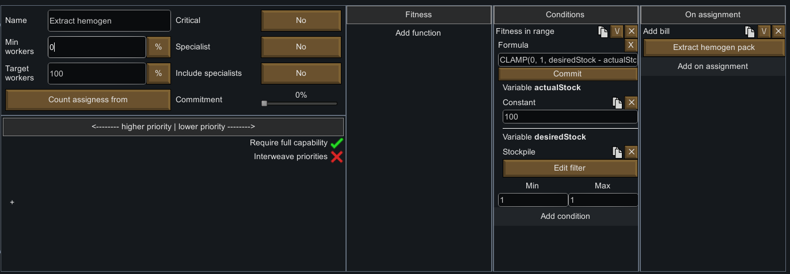

# The fitness formula editor

This fitness function allows you to enter complex formula. It is a generalization of other fitness functions, such as `Sum`, `Multiply`, `Average`, and much more.

Type in a formula, then click `Commit` to list its *variables* and bind them to other fitness functions.

## Example of use case:

- **Extract hemogen packs until you have a desired amount**:
  
  `CLAMP(0, 1, desiredStock - actualStock)`: Set `desiredStock` to the desired amount of a resource (here, 100), and `actualStock` to a *stockpile* function where you select the resource you want (here, hemogen packs).

## Supported operators and functions

> See [source](../../AutomaticWorkAssignment/Source/PawnFitness/FormulaPawnFitness.Parser.cs)

- `+`: add
- `-`: subtract
- `*`: multiply
- `/`: divide
- `%`: modulo
- `**`: exponent
- `SQRT(value)`:
- `ROOT(value, power)`: For example, `ROOT(value, 3)` to get the cubic root
- `MAX(value, ...values)`: Get the maximum value in the listed ones
- `MIN(value, ...values)`: Get the minimum value in the listed ones
- `AVG(value, ...values)`: Get the average value of the listed values
- `CLAMP(min, max, value)`: Get `value` constrained between `[min, max]`
